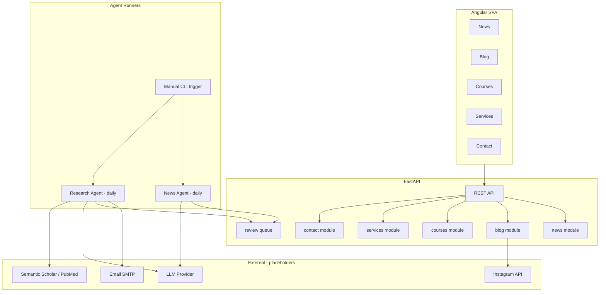

# Architecture — Medi Canopy

## Vision

Medi Canopy is an information hub for the cannabis ecosystem: market news, medical research, policy (Brazil-first, global coverage), courses, and end-to-end cultivation consulting. Content from automated agents is **never published directly** — it enters a review queue or email digest for the author.

## High-Level Diagram



## Layered Backend Structure

```
backend/app/
├── main.py                 # FastAPI app factory
├── core/                   # Config, dependencies, security
├── api/v1/                 # Versioned routers
│   ├── news.py
│   ├── blog.py
│   ├── courses.py
│   ├── services.py
│   ├── contact.py
│   └── review.py
├── models/                 # Pydantic schemas & domain models
├── services/               # Business logic
├── repositories/           # Data access (SQLite → PostgreSQL)
└── agents/                 # Agent integration adapters
```

## Scalability Roadmap

| Phase | Scope | Stack |
|-------|-------|-------|
| **1 — Demo (now)** | Monorepo, SQLite, placeholder agents, static course templates | FastAPI + Angular 16 |
| **2 — Content** | PostgreSQL, author admin panel, review workflow UI | Alembic migrations, JWT auth |
| **3 — Agents** | Real LLM + scholarly APIs, email digests, cron/K8s CronJob | Redis queue, Celery or APScheduler |
| **4 — Scale** | CDN, search (Elasticsearch), multi-language | Docker/K8s, i18n |

## API Versioning

All routes under `/api/v1/`. Breaking changes → `/api/v2/`.

## Data Flow: News

1. **News Agent** runs daily (or manually via `python -m agents.run --agent news`).
2. Agent searches reliable sources (config in `agents/config/news_sources.yaml`).
3. Results normalized → `ReviewItem` with status `pending`.
4. Author approves → promoted to published `NewsArticle`.
5. Frontend reads only `published` articles.

## Data Flow: Blog & Research

1. **Research Agent** fetches papers → `ScientificPaper` normalized via `PaperNormalizer`.
2. Digest emailed to author (`RESEARCH_DIGEST_TO` in debt.txt).
3. Author approves paper → `BlogPost` created with auto-formatting from normalizer.
4. Manual posts and Instagram imports coexist in `blog` module.

## Scientific Paper Normalizer

Class: `backend/app/services/paper_normalizer.py`

Maps raw API/JSON into a consistent blog-ready structure:

- `title`, `authors`, `abstract`, `doi`, `journal`, `published_date`
- `tags` (auto: medical, textile, policy, cultivation)
- `summary_pt` (placeholder for LLM summary)
- `citation_block`, `slug`, `hero_image_url`

## Frontend Module Map

```
frontend/src/app/
├── core/           # API service, interceptors, guards
├── shared/         # Header, footer, UI components
├── features/
│   ├── home/
│   ├── news/
│   ├── blog/
│   ├── courses/
│   ├── services/
│   └── contact/
└── styles/         # Brand tokens (_variables.scss)
```

## Cross-Origin

Backend enables CORS for `FRONTEND_URL`. Production: reverse proxy (nginx) serves both or separate domains with strict CORS.

## Agent DevOps

| Trigger | Command |
|---------|---------|
| Manual news | `python -m agents.run --agent news` |
| Manual research | `python -m agents.run --agent research` |
| Scheduled (future) | Cron / GitHub Actions / K8s CronJob → same CLI |

See [AGENTS.md](./AGENTS.md) and [../scripts/run-agents.ps1](../scripts/run-agents.ps1).
