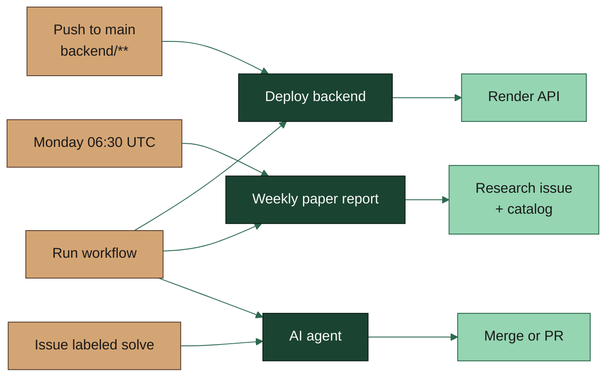

# GitHub Actions workflows

Visual overview of every workflow in `.github/workflows/`. GitHub renders the Mermaid diagrams on this page; the YAML files stay executable and link back here.

| Workflow | YAML | Diagram |
|----------|------|---------|
| Deploy backend | [`deploy-backend.yml`](../../.github/workflows/deploy-backend.yml) | [Page](./deploy-backend.md) |
| Weekly paper report | [`daily-cannabis-research.yml`](../../.github/workflows/daily-cannabis-research.yml) | [Page](./weekly-paper-report.md) |
| AI agent | [`cursor-issue-solver.yml`](../../.github/workflows/cursor-issue-solver.yml) | [Page](./ai-agent.md) |

## All workflows at a glance

## Diagram legend

| Color | Meaning |
|-------|---------|
| Gold | Trigger (`push`, schedule, label, manual run) |
| Deep green | GitHub Actions job |
| Mid green | Script or agent step |
| Mint | Decision |
| Light green | Successful output |
| Gray | Skipped / no-op path |
| Earth | External service (Render, Cursor) |

## Viewing the diagrams

GitHub renders Mermaid in markdown automatically. After these files are on the default branch (or in a pull request), open any page above on github.com — no extra GitHub setting is required for that.

If you connected **Mermaid Chart** to this repo:

1. Confirm the app can see this repository: GitHub → **Settings** → **Applications** → **Mermaid Chart** / **Mermaid Diagram Sync** → **Configure**, and include `medi-canopy`.
2. In VS Code, install the **Mermaid Chart** extension, then run **MermaidChart: Connect GitHub** once so previews and PR diagram review work.
3. Optional: add a `.mermaidignore` that lists `docs/workflows/` if you do **not** want the sync bot rewriting these presentation diagrams when YAML or Python changes. Leave it unignored if you want the bot to keep the pictures in sync with code.

For slides, copy a `mermaid` block into [mermaid.live](https://mermaid.live) and export SVG or PNG. The colors match [BRAND.md](../BRAND.md) (Forest Canopy).
