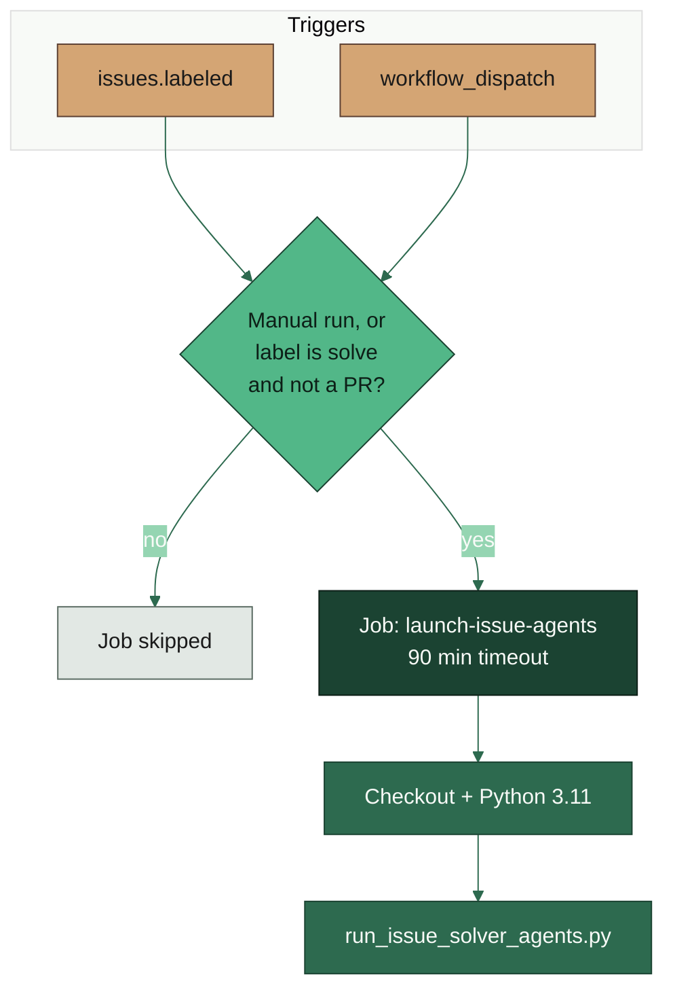
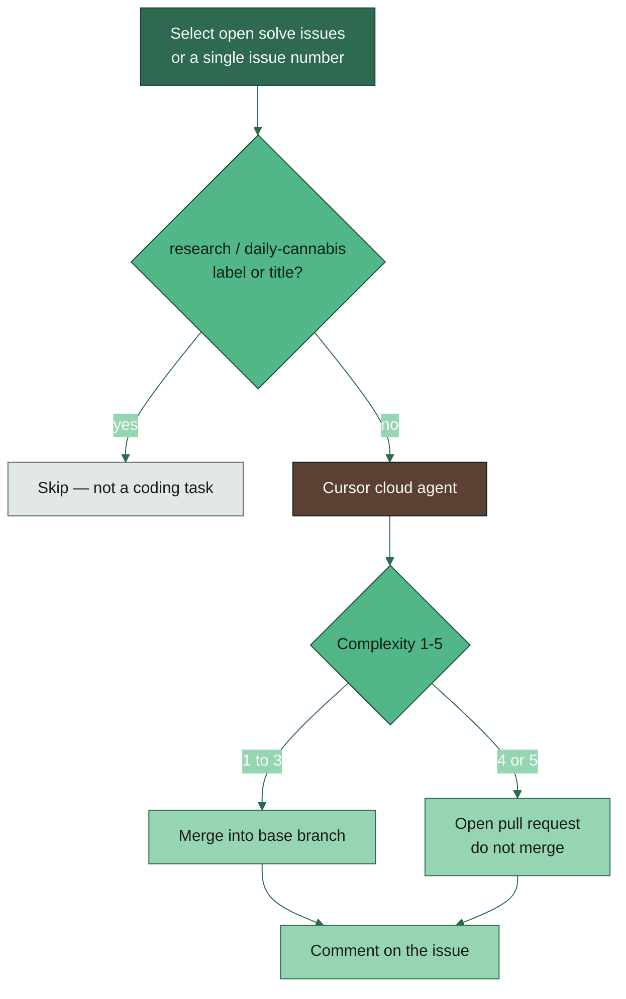

# AI agent

**YAML:** [`.github/workflows/cursor-issue-solver.yml`](../../.github/workflows/cursor-issue-solver.yml)
**Script:** [`scripts/run_issue_solver_agents.py`](../../scripts/run_issue_solver_agents.py)
**Secrets:** `CURSOR_API_KEY`, `GITHUB_TOKEN` (provided by Actions)

A Cursor cloud agent works an issue labeled `solve`. Complexity 1–3 is merged to the base branch; 4–5 opens a pull request. Research notes are never dispatched.

## Dispatch and outcomes

GitHub still fires `issues.labeled` when a **pull request** is labeled, so the job `if:` also requires `github.event.issue.pull_request == null`. Manual `workflow_dispatch` defaults to `dry_run=true`.

## Manual run

Actions tab → **🔧 AI AGENT** → **Run workflow**. Leave `dry_run` true to print planned actions without calling Cursor.

More context: [AGENTS.md](../AGENTS.md).
