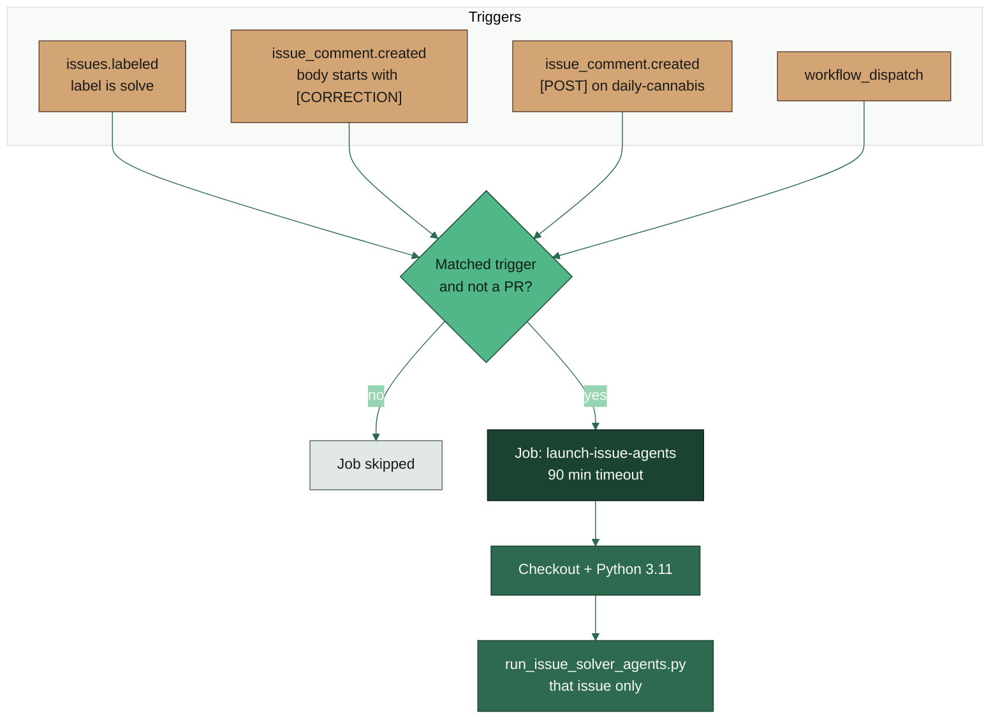
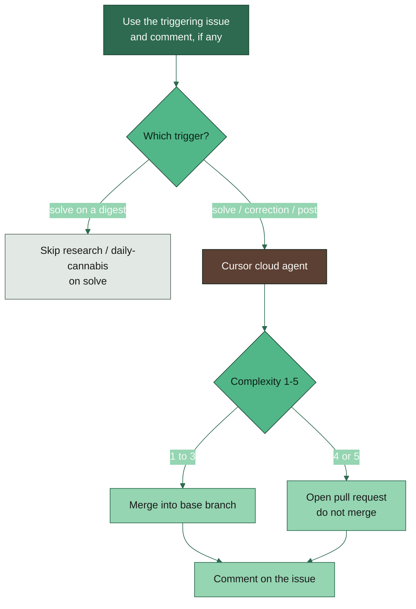

# AI agent

**YAML:** [`.github/workflows/cursor-issue-solver.yml`](../../.github/workflows/cursor-issue-solver.yml)
**Script:** [`scripts/run_issue_solver_agents.py`](../../scripts/run_issue_solver_agents.py)
**Secrets:** `CURSOR_API_KEY`, `GITHUB_TOKEN` (provided by Actions)

A Cursor cloud agent runs against **the issue that triggered the workflow** — it does not search for other open issues. Complexity 1–3 is merged to the base branch; 4–5 opens a pull request.

## Dispatch and outcomes

## What each trigger sends to the agent

| Trigger | Fires when | Prompt focus |
|---------|------------|--------------|
| `solve` | Issue labeled `solve` (including a new issue opened with that label) | Issue title, labels, and body |
| `correction` | Comment body starts with `[CORRECTION]` | The comment is the task; issue body is context only |
| `post` | Comment body starts with `[POST]` **and** the issue has `daily-cannabis` | Named paper(s); digest links are extracted and must be opened in depth before writing; every URL/DOI is copied onto the site as a clickable link |

Comments are enough to start the workflow. The issue does **not** need the `solve` label for `[CORRECTION]` or `[POST]`. Ordinary comments, and `[POST]` on issues without `daily-cannabis`, do not run the job.

GitHub still fires `issues` / `issue_comment` when the target is a **pull request**, so the job `if:` also requires `github.event.issue.pull_request == null`. Manual `workflow_dispatch` defaults to `dry_run=true` and requires an issue number.

## Manual run

Actions tab → **🔧 AI AGENT** → **Run workflow**. Set `issue_number`, optionally `trigger` and `comment_id`. Leave `dry_run` true to print planned actions without calling Cursor.

More context: [AGENTS.md](../AGENTS.md).
