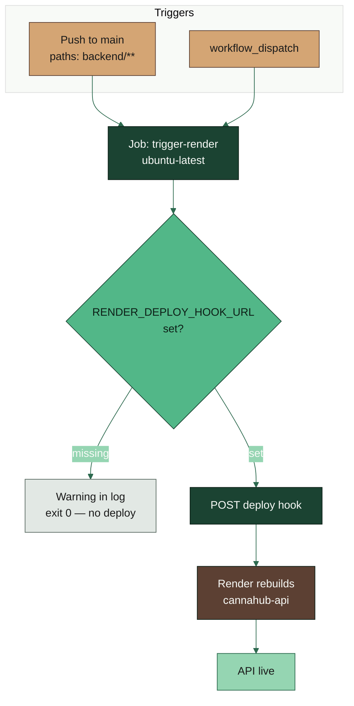

# Deploy backend

**YAML:** [`.github/workflows/deploy-backend.yml`](../../.github/workflows/deploy-backend.yml)
**Secret:** `RENDER_DEPLOY_HOOK_URL`

Netlify already builds the frontend from GitHub. Render can miss a backend rebuild after a repo rename or if Auto-Deploy is off. This workflow POSTs the Render deploy hook whenever `backend/**` lands on `main`.

## What it does not do

- Does not check out the repo or run tests.
- Does not deploy the Angular frontend (Netlify).
- Missing secret is a skip, not a hard failure — the run stays green with a warning.

## Operator notes

Set the hook in GitHub → **Settings** → **Secrets and variables** → **Actions** from Render → **cannahub-api** → **Settings** → **Deploy Hook**. See [DEPLOY.md](../DEPLOY.md).
