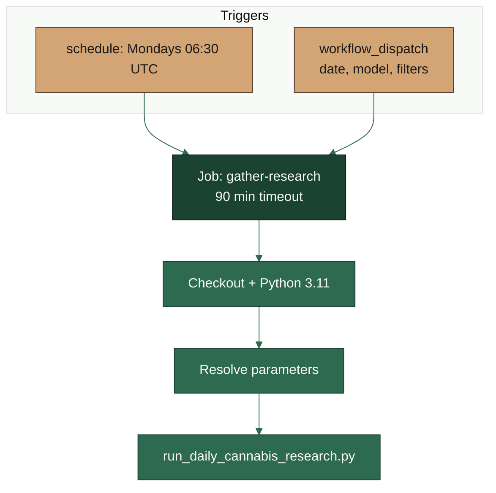
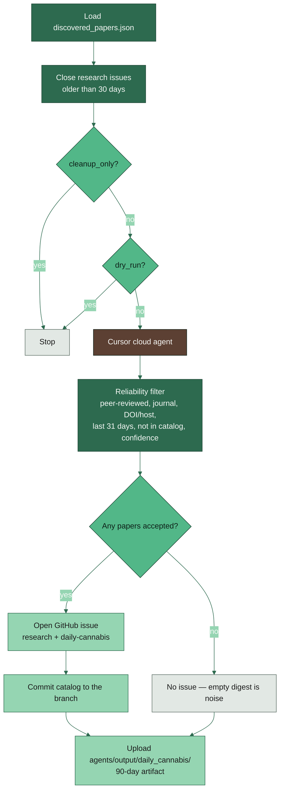

# Weekly paper report

**YAML:** [`.github/workflows/daily-cannabis-research.yml`](../../.github/workflows/daily-cannabis-research.yml)
**Script:** [`scripts/run_daily_cannabis_research.py`](../../scripts/run_daily_cannabis_research.py)
**Catalog:** `agents/data/discovered_papers.json`
**Secrets:** `CURSOR_API_KEY`, `GITHUB_TOKEN` (provided by Actions)

Mondays at 06:30 UTC (or a manual run) a Cursor cloud agent searches peer-reviewed cannabis literature. Surviving papers become a GitHub issue; they are never auto-published.



## Inside the script



## Reliability filter

A paper reaches the issue only if it is flagged peer-reviewed, names a journal, is not a preprint/blog/thesis/patent, has a DOI or a recognised publisher host, was published in the last 31 days, is not already in the catalog, and meets `--min-confidence` (default `0.7`). Rejected candidates stay in the job summary and the artifact.

Research issues are not coding tasks. The AI agent workflow only starts on the `solve` label, so these digests are not dispatched as fixes.

## Manual run

Actions tab → **🔬 WEEKLY PAPER REPORT** → **Run workflow**, or:

```bash
python scripts/run_daily_cannabis_research.py \
  --repo owner/repo --repo-url https://github.com/owner/repo --dry-run
```

More context: [AGENTS.md](../AGENTS.md).
